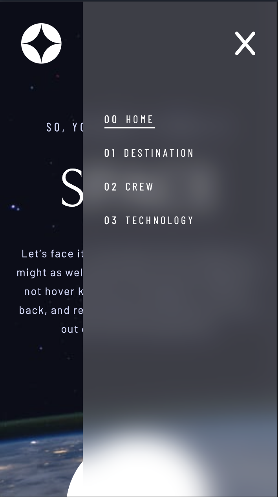
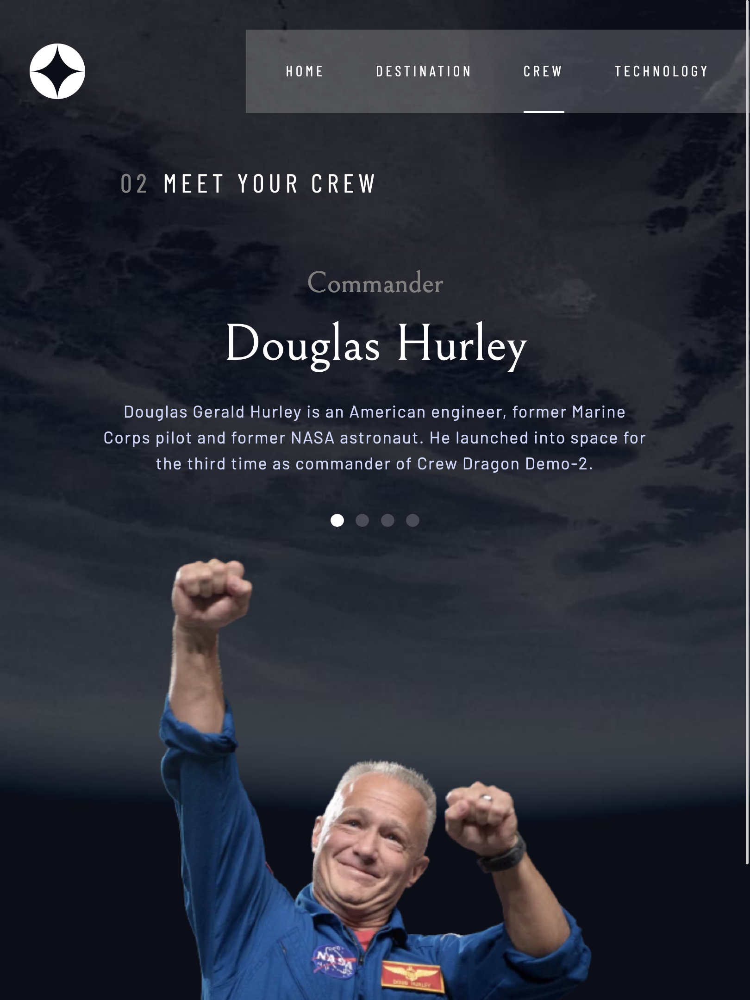
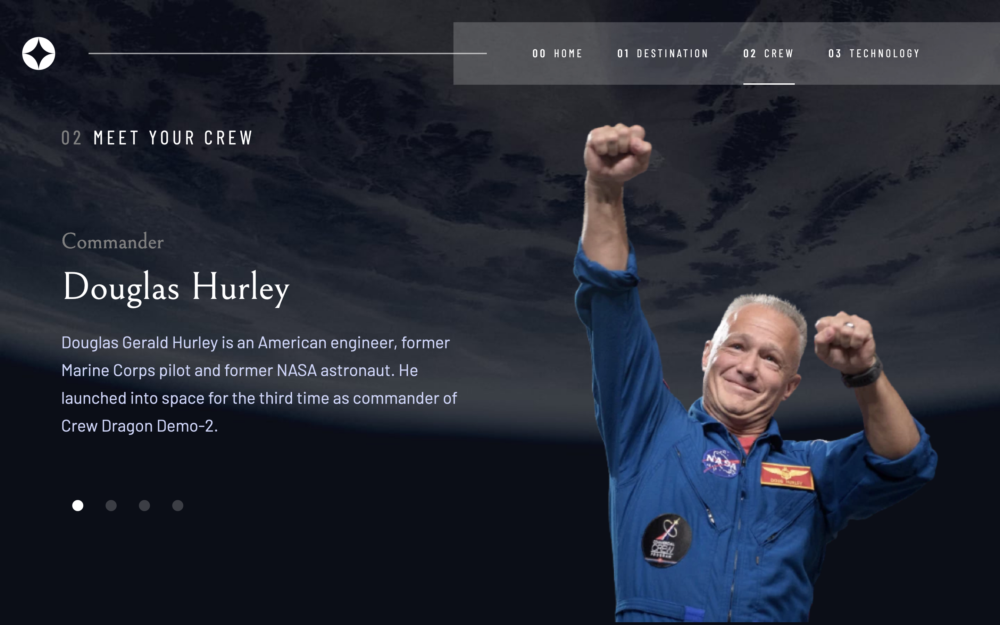

# Frontend Mentor - Space tourism website solution

This is a solution to the [Space tourism website challenge on Frontend Mentor](https://www.frontendmentor.io/challenges/space-tourism-multipage-website-gRWj1URZ3). Frontend Mentor challenges help you improve your coding skills by building realistic projects. 

## Table of contents

- [Overview](#overview)
  - [The challenge](#the-challenge)
  - [Screenshot](#screenshot)
  - [Links](#links)
- [My process](#my-process)
  - [Built with](#built-with)
  - [What I learned](#what-i-learned)
  - [Useful resources](#useful-resources)
- [Author](#author)

**Note: Delete this note and update the table of contents based on what sections you keep.**

## Overview

### The challenge

Users should be able to:

- View the optimal layout for each of the website's pages depending on their device's screen size
- See hover states for all interactive elements on the page
- View each page and be able to toggle between the tabs to see new information

### Screenshot

### Links

- Solution URL: [Github Repository](https://github.com/llhyuan/Space-tourism-website)
- Live Site URL: [Github page](https://llhyuan.github.io/Space-tourism-website/)

## My process

### Built with

- React hooks (useState, useContext, useEffect) 
- SCSS custom properties
- Flexbox
- Mobile-first workflow
- [React](https://reactjs.org/) - JS library
- [React Router](https://reactrouter.com/en/main) - Client side rendering library 
- [Fontawesome](https://fontawesome.com/v5/docs/web/use-with/react) - For icons 

### What I learned

1, Using React Router for client side routing. 
  - Different pages are built as React components and loaded accordingly as the user navigates through the website. 
  - Url parameters are used to help load different data on the same page. 
  - Though data is provided locally in this project, loader and useLoaderData are used, faking a structure of fetching and filtering data from a database.

2, Using createContext, useContext and useEffect are used to coordinate among components.
  - A state is used at the root of the web app to keep track of the current page.
  - This information is then used to keep the navbar's active state in sync.
  - However, when user navigates back along the history stack, the navbar active status would not update.
      - context is used share navbar active status and the setter function to all other page components.
      - useEffect is used to call that setter function to update the navbar's active status, to be in sync with the current page.

3, Utility classes are used to make styling different titles across pages easiler. 
  - At the end of this project, I'm starting to see the point of tailwind css. Combine it with user defined utility classes might keep the html a bit tidier, while riding high on that TAILWIND. 

### Useful resources

- [React Router Tutorial](https://reactrouter.com/en/main/start/tutorial) - Following through this tutorial gives me a holistic idea of what react router can do. It's a good place to start.
- [YouTube tutorial on setting up utility classes](https://www.youtube.com/watch?v=gP8yFWCTr7Q) 

## Author

- LinkedIn - [Hangyuan Liu](www.linkedin.com/in/hangyuan-liu-a9282718b)
- Frontend Mentor - [@llhyuan](https://www.frontendmentor.io/profile/llhyuan)
